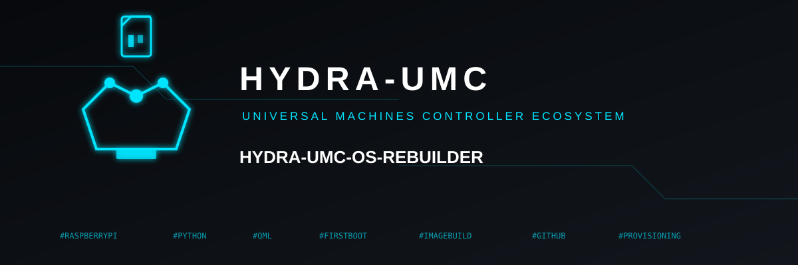

<p align="center">
  
</p>

# 🏗️ HYDRA-UMC-OS-REBUILDER

<p align="center"><a href="README.md">🇺🇸 English</a> | <a href="README_spa.md">🇪🇸 Español</a> | <a href="README_fra.md">🇫🇷 Français</a> | <a href="README_ita.md">🇮🇹 Italiano</a> | <a href="README_deu.md">🇩🇪 Deutsch</a> | 🇨🇳 <b>简体中文</b> | <a href="README_jpn.md">🇯🇵 日本語</a></p>

### 📀 构建一份即刻可烧录、完全最新的 CM5 镜像

<p align="center">
  
  
  
  
</p>

> **状态：v0.1.6，脚手架阶段。** CLI、生态系统发现、首次启动配置生成器和
> 图形界面都是真实并已测试的功能。真正的端到端镜像构建流程（下载 → 环回
> 挂载 → chroot 安装 → 卸载）已实现，但只能在具备 root 权限的真实 Linux
> 主机上运行 - 具体的平台边界及其存在的原因见
> [docs/CLI_REFERENCE.md](docs/CLI_REFERENCE.md)。

---

## 1. 🛠️ 技术概览

HYDRA-UMC-OS-REBUILDER 是一款 Windows/Linux 桌面工具 - 默认为窗口化图形
界面，也可通过 `--cli` 使用完整命令行 - 它回答了每一次真实 CM5 部署最终
都会遇到的问题：**"帮我构建一张全新的 SD 卡/eMMC 镜像，预装每个生态系统
项目的最新真实版本，并让我在写入之前设置 Wi-Fi/用户/主机名/SSH。"**

它真正做三件事：

1. **查询 GitHub。** HYDRA-UMC/URTC 生态系统中每一个自身
   `hydra-umc.project.json` 声明了 `"deployment_target": "cm5"` 的仓库都
   会被动态发现（绝不是固定列表），并读取其当前发布的版本 - 依赖
   `hydra-umc-updater` 作为真实的库来完成这项工作，而不是重新实现一份可能
   悄悄偏离其发现代码的第二实现。
2. **构建真实镜像。** 下载一个固定版本、经过校验和验证的 Raspberry Pi OS
   基础镜像，以环回方式挂载，并通过在镜像的 chroot 环境中运行**该项目自身
   的 `build.sh`** 来安装/更新每个被发现的项目 - 绝不重新实现任何项目自己
   的构建步骤。
3. **写入真实的首次启动配置。** 主机名、一个使用 `passlib` 真实哈希密码
   的新用户、Wi-Fi、时区、键盘布局和 SSH - 与 Raspberry Pi Imager 自身
   "OS Customisation" 界面在 Raspberry Pi OS（Bookworm 及更新版本）镜像上
   使用的完全相同的真实 `firstrun.sh` 机制，因此最终生成的 SD 卡的行为与
   Raspberry Pi Imager 本身生成的完全一致。参见
   [docs/FIRST_BOOT_CONFIG.md](docs/FIRST_BOOT_CONFIG.md)。
4. **在发布之前扫描自身的输出。** 在构建好的镜像被移动到最终路径之前，会
   检查已挂载的 rootfs 中是否留有真实的 Wi-Fi 密码（存在于
   `wpa_supplicant.conf` 或某个 NetworkManager 连接配置文件中）、真实的
   SSH 私钥、非空的 shell 历史记录，或者遗留的 `.env` 文件——任何真实的
   发现都会彻底阻止发布，就像清理失败时已经会做的那样。校验和验证过去只
   覆盖了输入（基础镜像）；这是首次对构建过程本身在输出中留下了什么进行
   检查。

```
$ hydra-umc-os-rebuilder --cli status
HYDRA-UMC-SERVER 0.4.8 (api/node)
HYDRA-UMC-VISION-STREAMER 0.0.3 (service/python)
HYDRA-UMC-GATEWAY-INDUSTRIAL 0.0.3 (api/node)
...
TOTAL=27

$ hydra-umc-os-rebuilder --cli config --out ./boot \
    --hostname hydra-umc-cm5 --username hydra-umc --password '请修改' \
    --wifi-ssid 我的网络 --wifi-password 'wifi密码' --wifi-country CN
CONFIG_WRITTEN out=boot firstrun=firstrun.sh
```

不带任何参数运行时，会在 Qt Quick 桌面界面中打开同样的信息 - 复用与
HYDRA-UMC-UPDATER 相同的视觉语言（相同的深色调色板、字体排印和组件集），
分为三个标签页：生态系统状态、构建镜像、首次启动配置。

## 2. 🧱 架构与设计决策

- **`ecosystem_plan.py` 绝不重新实现 GitHub 发现逻辑。** 它依赖
  `hydra-umc-updater` 作为真实的 Python 包
  （`hydra_umc_updater.github_client.discover_remote_projects()`），而不是
  再复制一份其清单校验/重试/退避逻辑 - 该项目那边的修复或改进会自动惠及
  本工具。
- **`image_builder.py` 绝不重新实现某个项目自己的构建。** 每个生态系统
  项目都会以其自身真实固定的版本被克隆，并通过在目标 rootfs 的 chroot 中
  运行**该项目自己的** `build.sh` 来完成构建 - 与 `hydra-umc-updater` 自身
  `install.py` 已经记录的"委托给每个项目自己的构建脚本"原则相同。
- **Linux/root 平台边界始终最先检查。** `check_build_platform()` 是
  `build_image()` 做的第一件事 - 一次在不受支持的主机（Windows、非 root
  的 Linux 用户、缺少 `losetup`/`chroot`）上悄悄空转的构建，会比一个带着
  明确理由拒绝启动的构建更糟糕。
- **`firstboot_config.py` 是一个没有副作用的纯生成器。** 它只产生纯文本
  文件内容（一个 `firstrun.sh` 字符串、一个 `cmdline.txt` 补丁字符串） -
  它自身从不触碰真实的镜像或文件系统，因此无需 root 或真实镜像即可轻松
  测试。只有 `image_builder.py` 负责真正把这些内容写入真实的 boot 分区。
- **真实的 SHA-512-crypt 密码哈希，而非标准库的 `crypt` 模块。** `crypt`
  只是包装了*主机自身*的 libc 调用（仅限 Unix，且已在 Python 3.13 中彻底
  移除） - `passlib` 在本工具运行的任何平台（包括 Windows）上都能生成与
  `chpasswd -e` 期望完全一致的真实 `$6$...` 格式。

## 📂 目录结构

```
HYDRA-UMC-OS-REBUILDER/
├── src/hydra_umc_os_rebuilder/
│   ├── ecosystem_plan.py    # 真实的 CM5 项目/版本计划，基于 hydra_umc_updater 自身的发现能力构建
│   ├── firstboot_config.py  # 纯粹的 firstrun.sh/cmdline.txt 生成器 - 不访问文件系统
│   ├── image_builder.py     # 真实的下载/环回挂载/chroot 安装流程，仅限 Linux/root
│   ├── i18n.py               # 真实、完整的图形界面翻译（7 种语言）
│   ├── qt_gui.py             # 覆盖在上述真实模块之上的 Qt Quick 桥接，与 CLI 使用的完全相同
│   ├── qml/Main.qml          # 主题化的桌面界面：生态系统状态 / 构建镜像 / 首次启动配置
│   └── main.py                # 分派：默认图形界面，--cli 用于 status/config/build-image
├── tests/                    # 真实测试：firstboot_config、ecosystem_plan、i18n
├── docs/
│   ├── CLI_REFERENCE.md       # 命令参考
│   └── FIRST_BOOT_CONFIG.md   # 本工具复现的真实 firstrun.sh 机制，以及原因
├── images/                    # 素材、应用图标和横幅
├── tools/
│   ├── build_test.py          # 非版本化的构建/编译检查
│   └── ci_validate.py         # CI 使用的清单/CHANGELOG/文档校验
├── build.sh / build.bat       # venv + 可编辑安装 + 编译检查
├── run.sh / run.bat           # 默认图形界面 / CLI 入口
├── run-gui.vbs                # 无控制台窗口的 Windows 图形启动器
├── bump_version.py            # 全生态系统里程表式版本递增（pyproject.toml + __init__.py）
└── bump_manifest_version.py   # 将 hydra-umc.project.json 的版本与原生版本同步（--sync）
```

## ⚙️ 构建与运行指南

```bash
chmod +x build.sh   # 仅需一次
./build.sh          # 创建 .venv、pip install -e ".[dev,gui]"、检查编译、运行 pytest
./run.sh                                # 窗口化图形界面（默认）
./run.sh --cli status                   # 每个生态系统项目最新的真实 GitHub 版本
./run.sh --cli config --out ./boot ...  # 写入首次启动配置（各选项见 docs/CLI_REFERENCE.md）
./run.sh --cli build-image --out FILE   # 构建一份即刻可烧录的 .img（仅限 Linux/root）
```

在 Windows 上：先运行 `build.bat`，再运行 `run.bat`（图形界面）/
`run.bat --cli status` / `run.bat --cli config ...`。`build-image` 无论
如何都需要一台具备 root 权限的真实 Linux 主机 - 见
[docs/CLI_REFERENCE.md](docs/CLI_REFERENCE.md)。

**故障排查**

- `--cli build-image` 以 `BUILD_BLOCKED reason=...` 退出：请阅读具体原因
  - 它会准确指出缺失的部分（不是 Linux、没有 root，或 `PATH` 中缺少某个
    具体工具），而不是一个笼统的失败信息。
- `--cli config` 抛出校验错误：你给出的主机名/用户名/Wi-Fi 国家代码不符合
  这些字段所要求的真实、严格的格式 - 参见 `firstboot_config.py` 自身的
  校验逻辑。
- 图形界面的"生态系统状态"标签页始终为空：请检查你的网络 - 本工具的
  `status`/发现功能需要真实连接到 `github.com`/`raw.githubusercontent.com`，
  与 `hydra-umc-updater` 本身相同。

## 🚀 路线图

- 为非树莓派基础镜像支持 cloud-init 作为替代的首次启动机制，与当前的
  `firstrun.sh` 路径并存。
- 增量镜像更新（在现有 `.img` 上打补丁而非完全重建），一旦出现超出从零
  构建的真实需求即实现。
- 为 `status` 提供 `--json` 输出模式，便于脚本化使用。
- 独立打包的图形界面可执行文件（PyInstaller），遵循与
  HYDRA-UMC-SUITE 自身 `build_exe.bat`/`.sh` 相同的约定，实现无需
  `pip`/venv 步骤的双击安装。

## 🔗 相关项目

本项目是同一作者（JuanenRac / Electro Hobby 3D）打造的 HYDRA-UMC 机器人生态系统的一部分。值得了解，因为某个请求实际上可能与这些项目有关，而不是这个仓库本身。

**直接相关**
- **[HYDRA-UMC-OS](https://github.com/JuanenRac/HYDRA-UMC-OS)** — 本工具真正构建其镜像的可复现 Raspberry Pi OS 产品层：只读代理、经过验证的配置/配置文件、Wi-Fi 首次接触配置。
- **[HYDRA-UMC-UPDATER](https://github.com/JuanenRac/HYDRA-UMC-UPDATER)** — 本工具作为真实库依赖以进行 GitHub 发现的姊妹生态系统运维工具 - 在已运行的机器上检测、安装并手动更新整个生态系统，而本工具则是从零构建一台全新的。
- **[HYDRA-UMC-OPS-AGENT](https://github.com/JuanenRac/HYDRA-UMC-OPS-AGENT)** — 维护事件协调器：一个低权限的边缘角色采集经过脱敏的库存/健康快照，一个控制面角色以只读方式渲染它，并请求某个 AI 提供方给出诊断建议——从不应用补丁，也从不部署任何内容。

**同样属于生态系统的项目**

*核心硬件与平台*
- **[HYDRA-UMC-SDK](https://github.com/JuanenRac/HYDRA-UMC-SDK)** — 每个桥接程序验证其命令所依据的共享 JSON-Schema 契约和安全门限。
- **[HYDRA-UMC-CONNECTOR-HUB](https://github.com/JuanenRac/HYDRA-UMC-CONNECTOR-HUB)** — 面向外部机器连接器的声明式适配器清单注册与校验工具；把 SDK 自身的契约理念扩展到外部机器，而不取代工业网关类项目。

*核心后端与客户端*
- **[HYDRA-UMC](https://github.com/JuanenRac/HYDRA-UMC)** — 机械臂的物理主板：CM5 主机 + 双核 STM32H745，通过 CAN-OTA/SPI-OTA 协调最多 8 个工具臂。
- **[HYDRA-UMC-SERVER](https://github.com/JuanenRac/HYDRA-UMC-SERVER)** — 每个控制客户端实际通信的真实无头后端（REST/WebSocket）。
- **[HYDRA-UMC-STUDIO](https://github.com/JuanenRac/HYDRA-UMC-STUDIO)** — 具备实时多机器人 3D 可视化的网页控制面板。
- **[HYDRA-UMC-SUITE](https://github.com/JuanenRac/HYDRA-UMC-SUITE)** — 可同时管理多台服务器的桌面（PySide6）集群指挥中心。
- **[HYDRA-UMC-ANDROID-CONTROL](https://github.com/JuanenRac/HYDRA-UMC-ANDROID-CONTROL)** — 带生物识别登录和配对 Wear OS 伴侣应用的原生 Android 控制应用。
- **[HYDRA-UMC-IOS-CONTROL](https://github.com/JuanenRac/HYDRA-UMC-IOS-CONTROL)** — 带实时 WebSocket 同步的 iOS/iPadOS 控制应用（Flutter）。
- **[HYDRA-UMC-DSI](https://github.com/JuanenRac/HYDRA-UMC-DSI)** — CM5 自身搭载的 7 英寸 DSI 触摸屏的原生触控界面。
- **[HYDRA-UMC-EDITOR-URDF](https://github.com/JuanenRac/HYDRA-UMC-EDITOR-URDF)** — 将完成的模型推送到 STUDIO 自身目录的桌面图形化 URDF 创建/编辑器。
- **[HYDRA-UMC-BRIDGE-AMR](https://github.com/JuanenRac/HYDRA-UMC-BRIDGE-AMR)** — 通过真实的 VDA 5050 MQTT 发布器为 AGV/AMR 车队提供的协调边界。
- **[HYDRA-UMC-BRIDGE-CNC](https://github.com/JuanenRac/HYDRA-UMC-BRIDGE-CNC)** — 具备真实 GRBL 状态/控制字节访问的高层 CNC 单元协调器。
- **[HYDRA-UMC-BRIDGE-DROIDS](https://github.com/JuanenRac/HYDRA-UMC-BRIDGE-DROIDS)** — 面向腿足/人形机器人的协调边界，配有真实的波士顿动力 Spot 指令发送器。
- **[HYDRA-UMC-BRIDGE-LASER](https://github.com/JuanenRac/HYDRA-UMC-BRIDGE-LASER)** — 读取 3 个真实钥匙/外壳/联锁 GPIO 防护装置的激光单元安全协调器。
- **[HYDRA-UMC-BRIDGE-OPENPNP](https://github.com/JuanenRac/HYDRA-UMC-BRIDGE-OPENPNP)** — 面向 OpenPnP 贴片的安全高层板流协调器。
- **[HYDRA-UMC-BRIDGE-PRINTER3D](https://github.com/JuanenRac/HYDRA-UMC-BRIDGE-PRINTER3D)** — 面向 Moonraker/Klipper 3D 打印机的安全协调边界，具备真实受控的任务命令。
- **[HYDRA-UMC-BRIDGE-ROS2](https://github.com/JuanenRac/HYDRA-UMC-BRIDGE-ROS2)** — 具备真实、延迟导入的 rclpy ROS 2 传输层的安全协调器。
- **[HYDRA-UMC-BRIDGE-UAV](https://github.com/JuanenRac/HYDRA-UMC-BRIDGE-UAV)** — 面向配备摄像头的无人机的协调边界，配有真实的 MAVLink 指令发送器。

*URTC 工具平台*
- **[URTC](https://github.com/JuanenRac/URTC)** — 物理 Universal Robot Tool Controller 板卡的固件，通过 CAN 总线提供 25+ 种工具配置文件。
- **[URTC-FLASHER](https://github.com/JuanenRac/URTC-FLASHER)** — 用于烧录 URTC 板卡的桌面图形工具，支持 CAN-OTA 以及完整芯片 SWD/JTAG。
- **[URTC-TESTER](https://github.com/JuanenRac/URTC-TESTER)** — 面向 URTC 板卡的桌面实时 CAN 总线诊断工具，每个工具配置文件一个面板。
- **[URTC-WEB-STUDIO](https://github.com/JuanenRac/URTC-WEB-STUDIO)** — 通过 Web Serial API 提供的浏览器版 URTC-TESTER 替代方案，无需本地安装。

*视觉 AI 节点（Hailo-8）*
- **[HYDRA-UMC-VISION-NODE](https://github.com/JuanenRac/HYDRA-UMC-VISION-NODE)** — Hailo-8 视觉流水线的集成中枢，具备真实的分阶段硬件就绪检查。
- **[HYDRA-UMC-DETECTION-HEF](https://github.com/JuanenRac/HYDRA-UMC-DETECTION-HEF)** — 具备 Hailo 架构/校验和安全加载验证的真实已编译模型注册表。
- **[HYDRA-UMC-VISION-STREAMER](https://github.com/JuanenRac/HYDRA-UMC-VISION-STREAMER)** — 具备真实 HailoRT 集成边界的真实 GStreamer 流水线 + MediaMTX 配置生成器。
- **[HYDRA-UMC-VISUAL-SERVOING-API](https://github.com/JuanenRac/HYDRA-UMC-VISUAL-SERVOING-API)** — 真实的基于位置的视觉伺服校正律，依据上游区域状态进行安全门控。
- **[HYDRA-UMC-SAFETY-ZONES](https://github.com/JuanenRac/HYDRA-UMC-SAFETY-ZONES)** — 真实的区域入侵检查和急停请求，强制要求校准保持最新。

*认知 AI 节点（Hailo-10）*
- **[HYDRA-UMC-COGNITIVE-NODE](https://github.com/JuanenRac/HYDRA-UMC-COGNITIVE-NODE)** — Hailo-10 认知流水线（LLM/VLA/语音编排）的集成中枢。
- **[HYDRA-UMC-VLA-ENGINE](https://github.com/JuanenRac/HYDRA-UMC-VLA-ENGINE)** — 面向视觉-语言-行动模型的真实动作令牌编解码与轨迹生成。
- **[HYDRA-UMC-VOICE-UI](https://github.com/JuanenRac/HYDRA-UMC-VOICE-UI)** — 具备受限、需确认的 Watch 中继功能的真实语音前端（VAD + 意图解析器）。
- **[HYDRA-UMC-SEMANTIC-PLANNER](https://github.com/JuanenRac/HYDRA-UMC-SEMANTIC-PLANNER)** — 针对 MCU 错误代码的真实基于规则的任务分解与语义错误恢复。
- **[HYDRA-UMC-DOCS-QA](https://github.com/JuanenRac/HYDRA-UMC-DOCS-QA)** — 针对本生态系统自身 Markdown 文档的真实纯标准库 TF-IDF 文档搜索。

*编排与集群*
- **[HYDRA-UMC-ORCHESTRATOR](https://github.com/JuanenRac/HYDRA-UMC-ORCHESTRATOR)** — 具备真实 gRPC/Protobuf 健康报告契约和任务状态机的集成中枢。
- **[HYDRA-UMC-JOB-DISPATCHER](https://github.com/JuanenRac/HYDRA-UMC-JOB-DISPATCHER)** — 基于真实 HTTP API、具备去重功能的真实优先级任务队列。
- **[HYDRA-UMC-NODE-HEALING](https://github.com/JuanenRac/HYDRA-UMC-NODE-HEALING)** — 基于 gRPC、具备重试/退避和身份不匹配检测的真实集群健康看门狗。
- **[HYDRA-UMC-PATH-PLANNER-3D](https://github.com/JuanenRac/HYDRA-UMC-PATH-PLANNER-3D)** — 具备真实障碍物/工作空间碰撞校验的真实基于 RRT 的 3D 路径规划器。
- **[HYDRA-UMC-SWARM-SYNC](https://github.com/JuanenRac/HYDRA-UMC-SWARM-SYNC)** — 经过属性测试以验证多单元收敛的真实 CRDT LWW-Element-Map 状态同步。

*数字孪生与仿真*
- **[HYDRA-UMC-TWIN](https://github.com/JuanenRac/HYDRA-UMC-TWIN)** — 数字孪生引擎的集成中枢，具备真实的版本兼容性同步契约。
- **[HYDRA-UMC-HIL-BRIDGE](https://github.com/JuanenRac/HYDRA-UMC-HIL-BRIDGE)** — 在仿真与真实硬件之间路由命令的真实硬件在环安全联锁。
- **[HYDRA-UMC-PHYSICS-REPLICA](https://github.com/JuanenRac/HYDRA-UMC-PHYSICS-REPLICA)** — 基于真实 URDF 子集的真实正向运动学与关节限位校验。
- **[HYDRA-UMC-SYNTHETIC-DATA-GEN](https://github.com/JuanenRac/HYDRA-UMC-SYNTHETIC-DATA-GEN)** — 具备 YOLO/COCO 标注导出功能的真实程序化 2D 场景生成器。

*数据与分析*
- **[HYDRA-UMC-DATALAKE](https://github.com/JuanenRac/HYDRA-UMC-DATALAKE)** — 基于 sqlite3、具备真实摄取/查询 HTTP API 的真实时间序列存储。
- **[HYDRA-UMC-ANOMALY-DETECTOR](https://github.com/JuanenRac/HYDRA-UMC-ANOMALY-DETECTOR)** — 具备漂移监测的真实 FFT + 统计基线异常检测器。
- **[HYDRA-UMC-PRODUCTION-REPORTS](https://github.com/JuanenRac/HYDRA-UMC-PRODUCTION-REPORTS)** — 基于 DATALAKE 历史数据、具备可复现 CSV 导出的真实 OEE/可用性计算。
- **[HYDRA-UMC-TELEMETRY-COLLECTOR](https://github.com/JuanenRac/HYDRA-UMC-TELEMETRY-COLLECTOR)** — 具备序列去重的真实 CAN/WebSocket 摄取流水线，写入 DATALAKE。

*工业网关*
- **[HYDRA-UMC-GATEWAY-INDUSTRIAL](https://github.com/JuanenRac/HYDRA-UMC-GATEWAY-INDUSTRIAL)** — 转发至工业协议的集成中枢，具备真实的命令白名单/背压层。
- **[HYDRA-UMC-OPCUA-SERVER](https://github.com/JuanenRac/HYDRA-UMC-OPCUA-SERVER)** — 经过真实二进制协议客户端会话验证的真实 OPC-UA 地址空间。
- **[HYDRA-UMC-MQTT-BROKER](https://github.com/JuanenRac/HYDRA-UMC-MQTT-BROKER)** — 具备可选的按客户端认证和主题 ACL 的真实 MQTT 代理。
- **[HYDRA-UMC-MTCONNECT-ADAPTER](https://github.com/JuanenRac/HYDRA-UMC-MTCONNECT-ADAPTER)** — 具备降级模式输出的真实 MTConnect `/probe` 和 `/current` XML 端点。

*配套工具与生态系统运维*
- **[HYDRA-UMC-DASHBOARD-AI](https://github.com/JuanenRac/HYDRA-UMC-DASHBOARD-AI)** — 基于 DATALAKE/ANOMALY-DETECTOR、具备诚实统计回退机制的智能摘要与异常高亮面板。
- **[HYDRA-UMC-TOOL-CLI](https://github.com/JuanenRac/HYDRA-UMC-TOOL-CLI)** — 具备真实、稳定退出码契约的集群 CLI，是 HYDRA-UMC-SERVER 自身 API 的真实在线客户端。
- **[HYDRA-UMC-WATCH](https://github.com/JuanenRac/HYDRA-UMC-WATCH)** — 具备真实触觉提醒和配对手机语音中继功能的 WearOS 伴侣应用。
- **[URTC-SMART-RACK](https://github.com/JuanenRac/URTC-SMART-RACK)** — 板卡安装机架的固件，具备真实的工具 ID 解码和 Smart Idle 预热逻辑。
- **[URTC-VISION-TOOL](https://github.com/JuanenRac/URTC-VISION-TOOL)** — 固件加上面向热成像/RGB 检测工具头的真实 Python 视觉伴侣程序。

---

## 📚 文档与社区

- **[docs/CLI_REFERENCE.md](docs/CLI_REFERENCE.md)** — 每个 `--cli` 子命令，附带真实示例输出。
- **[docs/FIRST_BOOT_CONFIG.md](docs/FIRST_BOOT_CONFIG.md)** — 本工具复现的真实 `firstrun.sh` 机制，以及原因。
- **[CONTRIBUTING.md](CONTRIBUTING.md)** — 提交 Pull Request 所需的技术栈与代码规范。
- **[CODE_OF_CONDUCT.md](CODE_OF_CONDUCT.md)** — 本社区期望的行为准则。
- **[SECURITY.md](SECURITY.md)** — 如何报告漏洞，以及本项目真实的安全关注点。
- **[SUPPORT.md](SUPPORT.md)** — 在哪里提问与报告错误。

## 👤 作者
**JuanenRac**（Electro Hobby 3D）
📧 electrohobby3d@gmail.com
📺 [youtube.com/@electrohobby3d](https://youtube.com/@electrohobby3d)

## 📜 许可证

GPL-3.0（软件）/ CC BY-SA 4.0（文档）- 详见 [LICENSE.md](LICENSE.md)。
